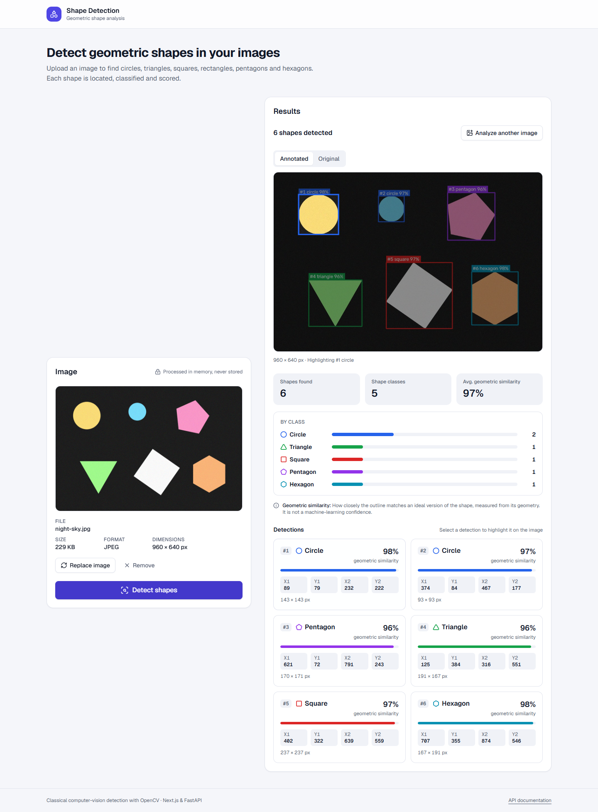
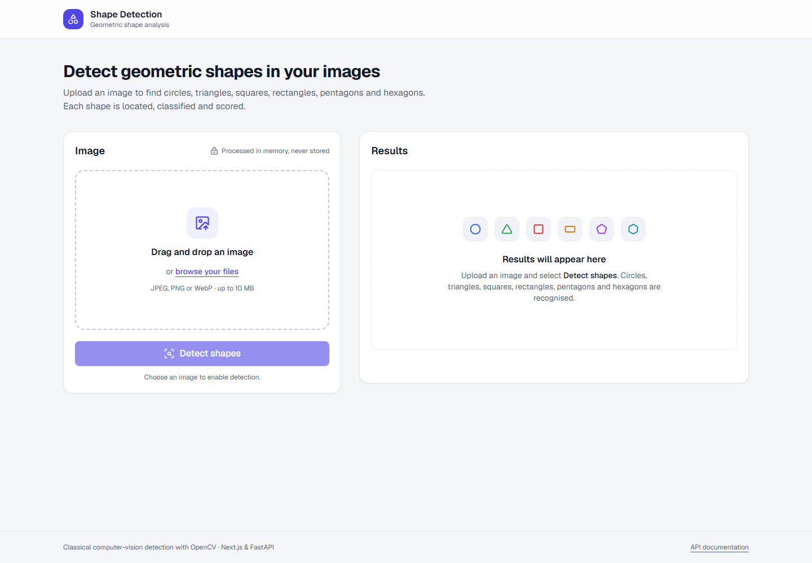
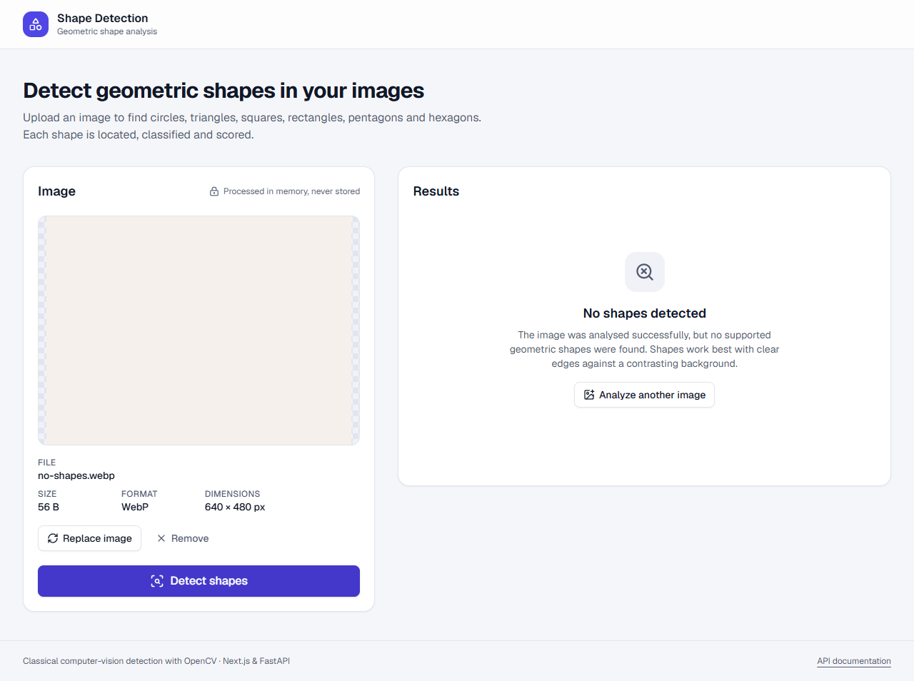
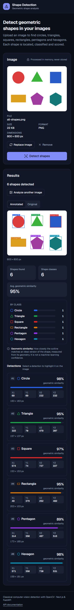

# Shape Detection

A full-stack web application that detects and classifies geometric shapes in images.
Upload a picture, and the app finds every **circle, triangle, square, rectangle,
pentagon and hexagon**. It draws a bounding box around each one, scores how closely it
matches its ideal geometry, and summarises the results.

**Next.js 16 · React 19 · TypeScript · Tailwind CSS 4** on the frontend, and **FastAPI · Pydantic
2 · OpenCV 5 · Pillow** on the backend.



<table>
  <tr>
    <td></td>
    <td></td>
    <td width="22%"></td>
  </tr>
</table>

---

## Contents

- [Features](#features)
- [Architecture](#architecture)
  - [Frontend: Feature-Sliced Design](#frontend-feature-sliced-design)
  - [Backend: Clean / Hexagonal architecture](#backend-clean--hexagonal-architecture)
- [Technology stack](#technology-stack)
- [Project structure](#project-structure)
- [Getting started](#getting-started)
- [Configuration](#configuration)
- [Development commands](#development-commands)
- [Testing and quality](#testing-and-quality)
- [Docker](#docker)
- [API](#api)
- [How detection works](#how-detection-works)
- [Limitations](#limitations)
- [Future improvements](#future-improvements)
- [Integrating a YOLO / custom model](#integrating-a-yolo--custom-model)

---

## Features

**Detection**
- Six shape classes, including rotated shapes, outlined vs filled shapes, light-on-dark
  images and nested shapes.
- Bounding boxes in original-image pixel coordinates, plus an annotated JPEG with
  numbered, colour-coded labels.
- **Honest scores.** OpenCV produces a *geometric similarity*, not a neural-network
  confidence, and the API and UI label it that way. A future model would report
  `model_confidence` instead.
- Summary statistics: total detections, distinct classes, per-class counts and the
  average score (only when all scores have the same type).

**User experience**
- A drag-and-drop or click-to-browse upload built on a real, keyboard-accessible file input.
- Instant client-side validation: content sniffing, size limit and decodability.
- A preview with file name, size, format and dimensions, and Replace or Remove.
- Clear states for idle, processing (indeterminate, no fake progress bar), success,
  **no shapes found** and every error, each with a way forward (retry, choose another
  image).
- Select or hover a detection to spotlight it on the image; toggle between the
  annotated and original views.
- A responsive two-column layout on desktop that becomes a single upload → preview →
  results column on mobile. Light and dark themes follow the system setting.

**Accessibility (WCAG-oriented)**
- Semantic landmarks and headings; labelled regions, lists and description lists.
- `aria-live` status announcements for progress and results; errors use `role="alert"`.
- Focus management: focus moves to the results heading after analysis, to the error
  after a failure, and back to the upload control after "Analyze another image".
- Visible `focus-visible` rings, AA-contrast colour tokens, and `prefers-reduced-motion`
  support.
- Colour is never the only signal: shapes have icons and text labels, and errors have
  an icon and a title.

**Robustness and security**
- The file format is detected from the file's content (magic bytes plus Pillow). The
  filename, extension and client-sent MIME type are ignored.
- Upload size is limited by `Content-Length` *and* by counting streamed bytes, so the
  multipart parser never buffers an oversized body.
- Width, height and total pixels are checked from the image header **before
  decoding**, and decompression bombs are rejected.
- Images are processed in memory and never stored. CPU-bound work runs off the event
  loop, and a limit caps how many detections run at once.
- CORS uses an explicit allow-list (a wildcard is rejected in production), and error
  responses never leak internals.
- Structured JSON logs carry a request ID, which is also returned as `X-Request-ID`
  and in every error body.

---

## Architecture

```
┌──────────────────────────── Browser ────────────────────────────┐
│  Next.js (static page)                                          │
│  app → pages → widgets → features → entities → shared           │
│                                   │                             │
│            POST /api/v1/detect (multipart)   GET /api/v1/health  │
└───────────────────────────────────┼─────────────────────────────┘
                                    ▼
┌──────────────────────────── FastAPI ────────────────────────────┐
│  api (routes, middleware, error mapping, composition root)      │
│        │ calls                                                  │
│  application (DetectShapes use case, ports, DTOs, errors)       │
│        │ depends on ▲ implemented by                            │
│  domain (Detection, BoundingBox, DetectionScore, ShapeClassifier)│
│  infrastructure (PillowImageDecoder, OpenCVShapeDetector,       │
│                  OpenCVImageAnnotator)                          │
└─────────────────────────────────────────────────────────────────┘
```

The two halves share one explicit, versioned contract: the Pydantic schemas in
`backend/app/schemas/`, mirrored by DTO types in `frontend/src/entities/detection/api/dto.ts`.
Neither side depends on the other's internals.

### Frontend: Feature-Sliced Design

**Why FSD?** A single `components/` folder hides *why* code exists and lets everything
import everything. FSD organises code by **responsibility and business meaning**, with
one rule that keeps it maintainable: **imports only point downward**.

```
app       → global styles, metadata                  (src/app)
pages     → page composition + cross-feature rules   (src/pages/detection)
widgets   → self-contained UI blocks                 (image-input-panel, detection-results)
features  → user actions                             (upload-image, detect-shapes)
entities  → domain concepts                          (detection)
shared    → business-agnostic infrastructure         (ui, api, lib, config)
```

| Layer | What lives there, and why |
| --- | --- |
| `shared` | Generic `Button`, `Card`, `Alert`, an accessible `FileDropzone`; an HTTP client that normalises *every* failure into a typed `ApiError` (`network \| timeout \| aborted \| http \| invalid_response`); byte-signature sniffing; env config. Knows nothing about shapes. |
| `entities/detection` | Domain types (`Detection`, `DetectionSummary`, `ScoreType`...), the wire DTOs, a runtime-validating parser from the untrusted JSON to domain types, score semantics (`formatScore`), shape metadata and presentational `DetectionItem` / `ShapeBadge`. |
| `features/upload-image` | Choosing an image: validation, preview-URL lifecycle (created and revoked by the hook), protection against races between async validations, the dropzone and the selected-image card. "Replace" lives here instead of in its own `replace-image` slice. |
| `features/detect-shapes` | The detection workflow as a `useReducer` state machine (`idle → processing → success \| error`). It prevents duplicate submissions, aborts on reset or unmount, and **ignores stale responses**. "Reset" is part of this feature instead of a separate slice. |
| `widgets` | `image-input-panel` composes both features into the upload column; `detection-results` renders every result state, the annotated viewer (SVG spotlight overlay), the summary and the list. |
| `pages/detection` | `useDetectionWorkflow` holds the rules that span features: a new image discards old results, and "analyze another" resets everything and refocuses the upload control. Sibling features can't import each other, so this logic belongs one layer up. |

**The Next.js `pages` conflict.** Next.js treats `src/pages` as its legacy Pages
Router. Following the official FSD recipe, routing lives in a thin root `app/` directory
(`app/page.tsx` just renders `DetectionPage`), and an empty root `pages/` folder makes
Next.js ignore `src/pages`.

**Enforced, not just documented.** `eslint.config.mjs` uses
`import/no-restricted-paths` (already bundled with `eslint-config-next`, so no extra
dependency) to forbid upward imports and cross-slice imports. It generates the zones
from the folder structure, so new slices are covered automatically. A
`no-restricted-imports` rule forces consumers through each slice's public `index.ts`.

**State:** local state and feature hooks only. There is one page and no cross-page
state, so Redux, Zustand or React Query would add weight without solving a problem.

### Backend: Clean / Hexagonal architecture

**Why?** The detection engine is the part most likely to change (OpenCV today, a
trained model tomorrow). Hexagonal architecture puts that behind a port, so the use
case and the HTTP contract don't change when it does.

| Layer | Depends on | Responsibility |
| --- | --- | --- |
| `domain` | nothing (pure Python) | `ShapeType`, `Detection`, `DetectionResult` (+ summary), value objects `BoundingBox` (validated, IoU), `DetectionScore` (+ `ScoreType`), `ImageSize`; the rule-based `ShapeClassifier`, which works on *measurements*, not pixels. |
| `application` | domain | The `DetectShapes` use case (decode → detect → reading-order sort → annotate); ports `ImageDecoder`, `ShapeDetector`, `ImageAnnotator` (`typing.Protocol`); framework-free errors with stable codes. |
| `infrastructure` | application, domain | Adapters: `PillowImageDecoder` (untrusted input handling), `OpenCVShapeDetector`, `OpenCVImageAnnotator`. |
| `api` | all of the above | Thin routes, middleware (request ID, access log, body-size limit, last-resort errors), error-to-HTTP mapping, and the **composition root** (`dependencies.py`), the only place that knows which adapter implements each port. |
| `schemas` | application, domain | Pydantic API contracts, deliberately separate from domain entities. |

The route handler is four lines: read the upload (with a size cap), run the use case
in a worker thread with a concurrency limit, and map the result to the response schema.

**Deliberate deviations from a "textbook" layout:** there's no `repositories/` because
nothing is persisted. Decoding and annotation are two separate ports instead of one
"image processor", because they change for different reasons. Application errors live
in `application/errors.py` because they belong to the use case, not the framework.
numpy arrays cross the port boundary as the neutral pixel format, since every realistic
detector (OpenCV, ONNX Runtime, Ultralytics) consumes them directly.

---

## Technology stack

| Area | Choice |
| --- | --- |
| Frontend | Next.js 16.3 (App Router, Turbopack, standalone output), React 19.3, TypeScript 5.9 (strict + `noUncheckedIndexedAccess`), Tailwind CSS 4.3, lucide-react |
| Frontend tooling | ESLint 9 (`eslint-config-next` + FSD boundary rules), Prettier 3 (+ Tailwind class sorting), Vitest 5, Testing Library, jsdom |
| Backend | Python ≥ 3.12 (developed on 3.14), FastAPI 0.142, Pydantic 2.13, pydantic-settings, Uvicorn, Pillow 12, OpenCV 5 (headless, CPU), NumPy 2 |
| Backend tooling | uv, Ruff (lint + format), mypy `--strict`, pytest 9, httpx2 (Starlette's TestClient now requires `httpx2`, the Pydantic-maintained successor of `httpx`) |
| Delivery | Multi-stage Dockerfiles (non-root), Docker Compose |

TypeScript 7 and ESLint 10 exist, but Next.js 16.3's toolchain targets TypeScript 5 and
ESLint 9 (it's what `create-next-app@16.3` installs), so those versions are used.

---

## Project structure

```
.
├── backend/
│   ├── app/
│   │   ├── api/               # routes (v1/), middleware, error handlers, composition root
│   │   ├── application/       # use_cases/, ports.py, dto/, errors.py
│   │   ├── domain/            # entities/, value_objects/, services/ (ShapeClassifier)
│   │   ├── infrastructure/    # detectors/opencv/, image_processing/ (decoder, annotator)
│   │   ├── schemas/           # Pydantic API contracts
│   │   ├── core/              # settings, structured logging
│   │   └── main.py            # create_app() factory
│   ├── tests/                 # unit/{domain,application,infrastructure,core}, api/, fixtures/
│   ├── scripts/generate_samples.py
│   ├── pyproject.toml · uv.lock · Dockerfile · .env.example
├── frontend/
│   ├── app/                   # Next.js routing only (layout, page, error, not-found, icon)
│   ├── pages/README.md        # intentionally empty; see "The Next.js pages conflict"
│   ├── src/
│   │   ├── app/               # FSD app layer: global styles/tokens, metadata
│   │   ├── pages/detection/
│   │   ├── widgets/           # image-input-panel, detection-results
│   │   ├── features/          # upload-image, detect-shapes
│   │   ├── entities/detection/
│   │   ├── shared/            # api, config, lib, ui
│   │   └── test/              # test fixtures (tooling, outside the FSD layers)
│   ├── eslint.config.mjs · vitest.config.mts · next.config.ts · Dockerfile · .env.local.example
├── samples/                   # demo images (generated)
├── docs/screenshots/
└── docker-compose.yml
```

---

## Getting started

### Prerequisites

- **Python 3.12+** and **[uv](https://docs.astral.sh/uv/)**
- **Node.js 20.9+** (developed on Node 24) and npm
- Optional: **Docker Desktop** for the containerised setup

### Backend (http://localhost:8000)

```bash
cd backend
uv sync                          # creates .venv with runtime + dev dependencies
cp .env.example .env             # optional; defaults work out of the box
uv run uvicorn app.main:create_app --factory --reload --port 8000
```

Interactive API docs: http://localhost:8000/docs

### Frontend (http://localhost:3000)

```bash
cd frontend
npm install
cp .env.local.example .env.local # optional; defaults to http://localhost:8000
npm run dev
```

### Sample images

```bash
cd backend
uv run python -m scripts.generate_samples   # writes ../samples/*.png|jpg|webp
```

`samples/` contains a scene with every class, outlined shapes, a dark noisy JPEG and an
image with no shapes.

---

## Configuration

### Backend (`backend/.env`, or environment variables)

| Variable | Default | Purpose |
| --- | --- | --- |
| `ENVIRONMENT` | `development` | `development` \| `test` \| `production` (production forbids `*` CORS) |
| `LOG_LEVEL` / `LOG_FORMAT` | `INFO` / `json` | `console` gives readable local logs |
| `ALLOWED_ORIGINS` | `http://localhost:3000` | Comma-separated CORS allow-list |
| `MAX_FILE_SIZE_MB` | `10` | Upload limit |
| `MAX_IMAGE_WIDTH` / `MAX_IMAGE_HEIGHT` | `7680` / `7680` | Dimension limits, checked before decoding |
| `MAX_IMAGE_PIXELS` | `40000000` | Total pixel budget (memory and decompression-bomb guard) |
| `MAX_CONCURRENT_DETECTIONS` | `2` | Detections allowed to run at once |
| `DETECTOR_BACKEND` | `opencv` | Detector adapter selection |
| `PROCESSING_MAX_DIMENSION` | `1600` | Longest side analysed; boxes are mapped back to full resolution |
| `MIN_CONTOUR_AREA` | `500` | Smallest shape, in px² of the original image |
| `CONTOUR_APPROXIMATION_FACTOR` | `0.04` | `approxPolyDP` tolerance (fraction of perimeter) |
| `CANNY_LOW_THRESHOLD` / `CANNY_HIGH_THRESHOLD` | `30` / `100` | Edge detection hysteresis |
| `CIRCLE_MIN_CIRCULARITY` / `CIRCLE_MIN_ENCLOSING_FILL` | `0.8` / `0.88` | Circle rules |
| `SQUARE_ASPECT_RATIO_TOLERANCE` | `0.1` | Square vs rectangle |
| `MIN_SOLIDITY` | `0.9` | Rejects concave contours |
| `MIN_DETECTION_SCORE` | `0.8` | Drops weak matches |
| `DUPLICATE_IOU_THRESHOLD` | `0.6` | Merges duplicate contours of one shape |
| `ANNOTATED_IMAGE_MAX_DIMENSION` / `ANNOTATED_IMAGE_QUALITY` | `2048` / `85` | Annotated JPEG size and quality |

All values are validated at startup (ranges and cross-field rules), so a
misconfiguration fails fast instead of misbehaving at runtime.

### Frontend (`frontend/.env.local`)

| Variable | Default | Purpose |
| --- | --- | --- |
| `NEXT_PUBLIC_API_URL` | `http://localhost:8000` | Backend base URL, as seen **from the browser** |
| `NEXT_PUBLIC_MAX_UPLOAD_MB` | `10` | Client-side limit for instant feedback (the backend is authoritative) |

`NEXT_PUBLIC_*` values are inlined at build time. For Docker they are build arguments.

---

## Development commands

| | Backend (`backend/`) | Frontend (`frontend/`) |
| --- | --- | --- |
| Run | `uv run uvicorn app.main:create_app --factory --reload` | `npm run dev` |
| Test | `uv run pytest` | `npm test` |
| Lint | `uv run ruff check .` | `npm run lint` |
| Format | `uv run ruff format .` | `npm run format` |
| Types | `uv run mypy app` | `npm run typecheck` |
| Build | — | `npm run build` |

---

## Testing and quality

**Backend: 128 tests, about 1 second.** Fixtures are **generated in code**
(`tests/fixtures/synthetic_images.py`) with known ground truth, so there are no binary
blobs and each test's intent is explicit.

- *Domain:* bounding-box validation and IoU, score ranges, summary counts and averages
  (including mixed score types), and classifier rules for each class plus the
  circle-vs-hexagon and square-vs-rectangle boundaries.
- *Detector:* each class; rotated squares; outlined vs filled; dark backgrounds; shapes
  distinguishable only by hue; nested shapes; noise plus JPEG artefacts; large-image
  downscaling with box re-mapping; no-shape images; rejection of ellipses and stars.
- *Decoder:* JPEG/PNG/WebP accepted; GIF, BMP, TIFF and PDF rejected; truncated and
  corrupted files; transparency; EXIF orientation; dimension limits; a crafted
  100 000 × 100 000 decompression bomb.
- *Use case:* run with a **fake "model" detector**, proving the port is swappable and
  score semantics are preserved.
- *API:* health; one, several and zero shapes; misleading filenames; 400/413/415/422;
  streamed bodies without `Content-Length`; CORS allow and deny; a sanitised 500 that
  keeps CORS headers and the request ID.

**Frontend: 47 tests** (Vitest + Testing Library): file validation, response parsing
(including malformed payloads), score formatting, HTTP error normalisation, the
detection state machine (duplicate submissions, aborts, stale responses, unmount), the
dropzone (keyboard, drag-and-drop, ARIA wiring), and full page flows (upload → loading →
results, no detections, retryable and non-retryable errors, invalid files, replace, and
"analyze another" with focus restoration).

Static checks: Ruff, `mypy --strict`, ESLint with FSD boundaries,
`tsc --noEmit` (strict), and Prettier.

---

## Docker

```bash
docker compose up --build
```

- Frontend → http://localhost:3000
- Backend → http://localhost:8000 (health check: `/api/v1/health`)

Both images are multi-stage and run as non-root users with health checks. The backend
uses the `uv` lockfile and the CPU-only `opencv-python-headless` wheel, and runs with a
read-only filesystem (with `/tmp` as tmpfs). The frontend uses Next.js `standalone` output.
The frontend waits for the backend to become healthy. To override backend settings,
create `backend/.env`; the compose file loads it when present.

---

## API

Interactive OpenAPI documentation is served at `/docs` (and `/openapi.json`).

### `GET /api/v1/health`

```json
{ "status": "ok", "version": "1.0.0", "detector": "opencv" }
```

### `POST /api/v1/detect`

Multipart form data with the image in the `file` field (JPEG, PNG or WebP).

```bash
curl -F "file=@samples/all-shapes.png" http://localhost:8000/api/v1/detect
```

```json
{
  "image": { "width": 800, "height": 600 },
  "detections": [
    {
      "id": 1,
      "class_name": "circle",
      "score": 0.9806,
      "score_type": "geometric_similarity",
      "bbox": { "x1": 69, "y1": 69, "x2": 232, "y2": 232 }
    }
  ],
  "summary": {
    "total": 1,
    "classes": 1,
    "by_class": { "circle": 1 },
    "average_score": 0.9806,
    "score_type": "geometric_similarity"
  },
  "annotated_image": "data:image/jpeg;base64,/9j/4AAQ..."
}
```

- `id` is 1-based in **reading order** (rows top to bottom, left to right within a row)
  and matches the `#n` label on the annotated image.
- `bbox` uses original-image pixels; `x1`/`y1` are inclusive and `x2`/`y2` exclusive.
- `score_type` is `geometric_similarity` (OpenCV) or `model_confidence` (learned
  detectors). `average_score` is `null` when there are no detections or the types are mixed.
- **No shapes is a successful `200`** with an empty `detections` list, not an error.

### Errors

Every error has the same envelope, with a stable machine-readable `code`:

```json
{ "error": { "code": "unsupported_format", "message": "Unsupported file type. Supported formats: JPEG, PNG, WEBP." }, "request_id": "8f3c..." }
```

| Status | `code` | When |
| --- | --- | --- |
| 400 | `empty_file`, `invalid_image` | Empty upload; corrupted or undecodable image |
| 413 | `file_too_large` | Over `MAX_FILE_SIZE_MB` |
| 415 | `unsupported_format` | Content isn't JPEG, PNG or WebP |
| 422 | `image_too_large`, `validation_error` | Dimensions over the limits; missing `file` field |
| 500 | `internal_error` | Unexpected failure (details are logged, never returned) |

---

## How detection works

`OpenCVShapeDetector` is a classical computer-vision pipeline:

1. **Decode and validate** (Pillow): identify the format from its signature, check
   dimensions against the header, verify integrity, apply EXIF orientation, and
   composite any transparency onto white.
2. **Downscale** so the longest side is at most `PROCESSING_MAX_DIMENSION`. A 12 MP image
   is analysed in about 20 ms, and boxes are mapped back to full resolution.
3. **Reduce noise** with a Gaussian blur.
4. **Detect edges** with Canny **on each colour channel**, combined. Grayscale alone
   misses shapes whose colour differs from the background but whose brightness does
   not (such as green on red).
5. **Close gaps** in the edges with a morphological close.
6. **Find contours** with `RETR_TREE`, so nested shapes are found too. Contours are
   filtered by minimum area and by a maximum fraction of the image (to drop the frame).
7. **Measure** each contour, producing scale-invariant features: vertex count after
   `approxPolyDP`, circularity (4πA/P²), solidity (area / convex hull), rotated aspect
   ratio (`minAreaRect`), polygon fit, enclosing-circle fill, and interior angles.
8. **Classify** in the domain `ShapeClassifier`:
   - Concave contours are rejected.
   - A **circle** needs high circularity *and* must fill its minimum enclosing circle.
     Approximating a circle's outline yields an arbitrary 5–8 vertices, so vertex
     counting alone can't separate circles from hexagons. A regular hexagon fills about
     83% of its enclosing circle; a circle fills about 100%.
   - Otherwise shapes are classified by vertex count: 3 is a triangle, 4 is a square or
     rectangle (depending on the *rotated* aspect ratio, so a 45° square is still a
     square), 5 is a pentagon and 6 is a hexagon. Anything else is rejected.
9. **Score** (geometric similarity, 0–1):
   - Polygons: the area agreement between the contour and its fitted polygon, times solidity.
   - Quadrilaterals, pentagons and hexagons: also multiplied by angle regularity, and
     squares by their aspect ratio.
   - Circles: enclosing-circle fill times solidity.
   - Detections below `MIN_DETECTION_SCORE` are dropped.
10. **Merge duplicates**: each edge yields inner and outer contours, and outlined shapes
    yield two per stroke. Class-aware suppression merges same-class overlaps, keeping
    the best score and the outermost extent. A circle inside a square survives because
    it's a different class.
11. **Annotate**: draw colour-coded boxes and `#n class score` labels, scaled to the
    output size, and encode as JPEG.

---

## Limitations

- **Classical CV, not learned recognition.** It works best on clear, flat-coloured
  shapes with distinct edges: diagrams, graphics, and photos of printed shapes. Busy
  photographs, soft shadows, textures and heavy blur reduce accuracy.
- **Occlusion:** overlapping shapes merge into a single contour. The score threshold
  suppresses most of the resulting non-shapes, but the partly hidden shape isn't
  recovered.
- **Unsupported shapes:** ellipses, stars and irregular polygons are rejected
  (intentionally). A regular octagon fills its enclosing circle about as well as a
  circle does and may be reported as a circle.
- Same-class concentric shapes that overlap by more than `DUPLICATE_IOU_THRESHOLD`
  are merged into one.
- Only the first frame of animated PNG/WebP files is analysed.
- The browser calls the API directly, which relies on `AbortSignal.any` (supported by
  all current evergreen browsers).

---

## Future improvements

- A trained detector (see below), with the OpenCV adapter kept as a fast fallback.
- Per-request tuning (e.g. a sensitivity slider mapped to `MIN_DETECTION_SCORE`).
- Batch uploads and a detection history, which would introduce the first real
  repository or persistence port.
- Returning contours or polygons in addition to boxes, for pixel-accurate overlays.
- A CI pipeline running the same checks, plus Playwright end-to-end tests against the
  compose stack.
- A strict Content Security Policy with nonces, and rate limiting at the edge.

---

## Integrating a YOLO / custom model

The use case depends only on the `ShapeDetector` port:

```
                    ┌── OpenCVShapeDetector   (today)
ShapeDetector ──────┤
                    └── YOLOShapeDetector     (drop-in)
```

1. **Implement the adapter** in `backend/app/infrastructure/detectors/yolo/detector.py`:

   ```python
   class YOLOShapeDetector:
       def __init__(self, model_path: Path, min_confidence: float) -> None:
           self._model = YOLO(model_path)          # e.g. ultralytics / onnxruntime
           self._min_confidence = min_confidence

       def detect(self, image: DecodedImage) -> list[Detection]:
           result = self._model(image.pixels, verbose=False)[0]   # BGR numpy in
           return [
               Detection(
                   shape=ShapeType(result.names[int(cls)]),
                   bbox=BoundingBox(*map(int, xyxy)),
                   score=DetectionScore(float(conf), ScoreType.MODEL_CONFIDENCE),
               )
               for xyxy, conf, cls in zip(result.boxes.xyxy, result.boxes.conf, result.boxes.cls)
               if conf >= self._min_confidence
           ]
   ```

2. **Configure it:** add `"yolo"` to `DETECTOR_BACKEND` (plus settings such as a model
   path) in `core/config.py`, and one `case "yolo":` in `build_detector()` in
   `api/dependencies.py`, the composition root.
3. **Map into the domain:** the model's class names map onto `ShapeType`, and boxes
   become `BoundingBox` values in original-image pixels.
4. **Keep the contract:** the API response doesn't change. `score_type` becomes
   `model_confidence`, and the frontend already labels it as "model confidence".

The use case, API routes, schemas, annotator and frontend need **no changes**. The
existing `FakeModelDetector` test in `tests/unit/application/test_detect_shapes.py` already
shows this substitution. For a GPU model, only the backend Dockerfile's base image changes.
